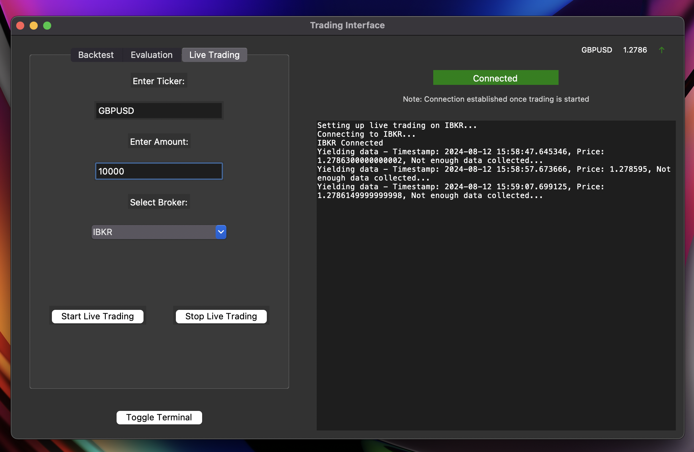

# Algo Trading Python App

Welcome to the Algo Trading Python App! This application provides a platform for implementing and testing various algorithmic trading strategies. Below is a brief overview of its key features and functionalities.



## Features:
### Strategies:
- Implement and test a wide range of trading strategies, from simple moving averages to advanced machine learning algorithms.
### Backtesting:
- Backtest your strategies using historical market data to evaluate their performance over time.
### LiveDataStream:
- Stream real-time market data to execute trading decisions based on up-to-the-minute information.
### BrokerAPI:
- Integrate with different broker APIs to execute trades automatically based on predefined strategies.
### TestBroker:
- Utilize a simulated broker environment for testing and debugging trading algorithms without risking real capital.

Configure your broker API credentials in the config.py file.

# Implemented so far
- [x] Multiprocessed backtesting working thought tickers and strategies.
- [x] Live Data Trading for chosen Ticker and Strategy.
- [x] Order validation; Price and amount check, order throttle.
- [ ] OrderBook validation; End of day OrderBook cross validation with Broker.
- [x] Interactive User Interface
- [ ] Risk Management
- [ ] Dashboard for Performance Metrics
- [ ] Machine Learning strategy optimisation
- [ ] Scheduled Backtesting

## Usage Examples:
### Backtesting:
Select a strategy from the available options.
Input the parameters required for the chosen strategy.
Specify the historical data range for backtesting.
View the performance metrics and visualizations generated after backtesting.

### Live Trading:
Ensure your broker API credentials are correctly configured.
Choose a strategy suitable for live trading.
Monitor the application as it executes trades based on real-time market data.


## Setup
This repository utilizes Anaconda (conda) for environment management. To set up the environment, use the provided environment.yml file:

```
conda env create -f environment.yml
conda activate backtrader
```

Backtrader relies on ```ibpy2```, which requires compatibility adjustments for Python 3 due to its original design for Python 2. To update ibpy2 for Python 3, execute:

```
find backtrader/lib/python3.9/site-packages/ib/ -name '*.py' -exec 2to3 -w {} \;
```

## Running the Code
There are currently two ways to run this app, from the user interface or from the main.py (for running each feature separetly)

### User Interface
The user interface is currently under development and is therefore very simple and straightforward. To run the user interface simply run ```alog_trading/main.py```

Once in the interface you will see something like this:


### Running from main.py
Note: This repository is under active development. The final implementation will support scheduled daily backtesting.

### Backtesting (Current State)
To perform backtesting, comment back in the following and run ```main.py```:


```
    # backtest = Backtester()
    # backtest.run_backtest()
```

Feel free to customize the list of stocks or currencies for backtesting as needed.

### Evaluation (Current State)
To perform an evaluation of your backtesting, there are a few steps to follow.

1. Create a ```utils/secrets.json```
2. Enter your email and email api password
3. Comment back in the following in ```main.py```:

30 denotes the number of days to look back over. And the following evaluation methods can be used:

```
    # backtest.evaluate(30, "all")
    # backtest.evaluate(10, "average")
    # backtest.evaluate(15, "ticker", "AAPL")
```

Feel free to customize the list of stocks or currencies for backtesting as needed.

### Live Trading (Current State)
Live trading functionality is not available!

This is currently in development, but if you wish to run you will need the IBKR TWS open and comment back the following in ```main.py```:

```
    # run_live_trading("GBPUSD", 10000, "IBKR", api)
```

In the final version, live trading will involve real-time data collection from Interactive Brokers (IBKR) every 10 seconds. The selected strategies will execute continuously based on this live data.
